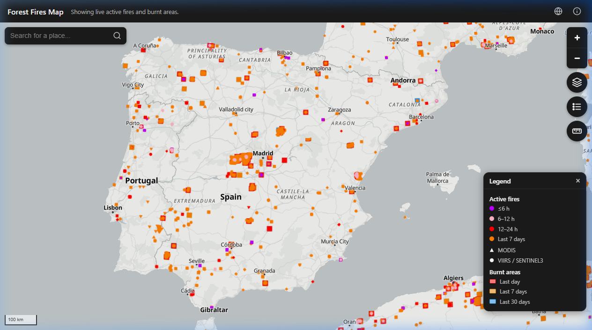

# Forest Fires Map

<p align="center">
  
</p>

<p align="center">
  <a href="https://forest-fires-map.vercel.app/"><strong>Live Demo</strong></a>
</p>

<p align="center">
  
</p>

A MapLibre GL viewer for forest fires / wildfires. Shows current active-fire
hotspots and burnt-area perimeters by default (each independently
toggleable), with a mode switch to browse historical burnt areas by year
instead. Rendered as a globe, with a choice of basemap styles.

## Data & basemap

- **Fire data**: [EFFIS](https://forest-fire.emergency.copernicus.eu/) (European
  Forest Fire Information System, EU Joint Research Centre / Copernicus
  Emergency Management Service), served as WMTS raster tiles:
  - **Active fires** — hotspot detections stacked from three satellite
    sources (MODIS, VIIRS, Sentinel-3).
  - **Burnt areas** — fire perimeter polygons stacked from two products
    (MODIS + near-real-time).
  - **Past fires** (by year, 2016+) — a per-year burnt-area raster layer,
    plus a WFS vector layer kept wired up for click-for-details popups
    (date/area/country/province) on the chance EFFIS's historically
    unreliable WFS endpoint improves.

  If EFFIS's active-fire tiles are unreachable, the app automatically falls
  back to fetching hotspot data directly from
  [NASA FIRMS](https://firms.modaps.eosdis.nasa.gov/) instead (EFFIS's own
  active-fire detection is itself built on FIRMS) — there's also a manual
  EFFIS/FIRMS toggle in the layers panel. FIRMS has no burnt-area or
  Sentinel-3-equivalent data, so that fallback only ever covers "Active
  fires".

- **Basemap**: several styles to choose from in the layers panel — a
  stripped-down [OpenFreeMap](https://openfreemap.org/) Liberty style
  (white background, black place labels only) by default, plus OpenFreeMap's
  Positron/Bright/Liberty/Dark/Fiord styles, Esri World Imagery satellite
  tiles, and a 3D (terrain + buildings) style. Country borders are drawn
  separately from Eurostat GISCO data.

None of EFFIS/FIRMS is called directly from the browser — everything goes
through a same-origin proxy (`vite.config.ts` in dev, a Vercel Edge Function
per upstream in production: `api/effis.ts`, `api/wmts.ts`, `api/firms.ts`),
since CORS support on these endpoints isn't guaranteed to stay open
indefinitely, and because FIRMS's API key must never reach the client.

## Develop

```sh
npm install
npm run dev
```

To exercise the NASA FIRMS fallback locally (either via the manual toggle or
the automatic cold-start check), add a `FIRMS_MAP_KEY` to a git-ignored
`.env.local` file — register a free one at
https://firms.modaps.eosdis.nasa.gov/api/map_key/. Without it, everything
else works normally; only the FIRMS fallback requests will fail.

## Build

```sh
npm run build   # type-checks then builds to dist/
npm run preview # serve the production build locally
```

## Deploy

Configured for [Vercel](https://vercel.com/): zero-config for the Vite
static build, with the three upstream proxies as Vercel Edge Functions
(`api/effis.ts`, `api/wmts.ts`, `api/firms.ts`, each routing automatically to
the matching `/api/...` path). Set `FIRMS_MAP_KEY` in the project's
environment variables (Vercel dashboard) for the NASA FIRMS fallback to work
in production. `vercel --prod` or a connected Git repo both work out of the
box — no `vercel.json` needed.
